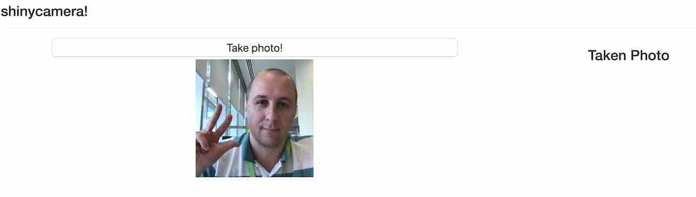

### Provides camera video stream to the shiny application.

Spin-off https://github.com/nstrayer/shinysense with mininal dependecies ( not tidy anymore 😢 ) - **all credits should go to [Nick Strayer](https://github.com/nstrayer)**.

```
app_script = system.file(paste0('demoapp/app.R'), package = 'shinycamera')
shiny::shinyAppFile(app_script)
```

